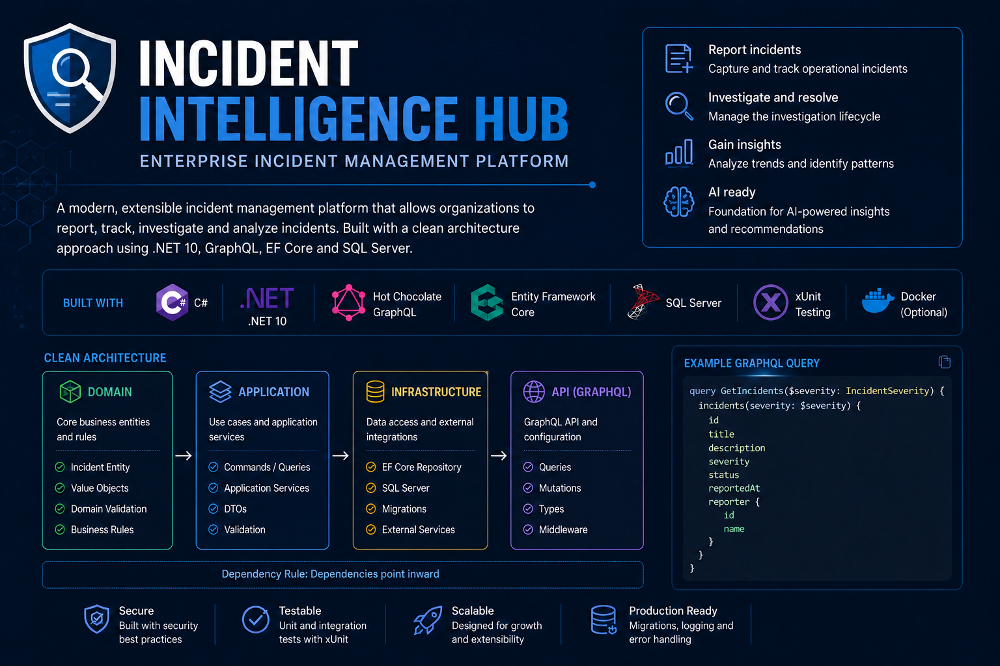

# Incident Intelligence Hub



An incident management platform designed for AI-assisted workflows This repository contains the
API and domain implementation. A React frontend and Azure deployment are
planned features (see Planned Features).

[](https://github.com/inkdry/incident-intelligence-hub/actions/workflows/build-and-test.yml)

## Overview

Incident Intelligence Hub helps teams record, investigate, and resolve
operational incidents. The platform will use AI to summarize incidents,
identify similar historical events, and generate draft post-incident reports.

## Current Features

- ASP.NET Core 10 GraphQL API (Hot Chocolate)
- GraphQL queries and mutations for incidents (status, list, report, update, start investigation)
- Entity Framework Core persistence to SQL Server (Incidents table and migrations)
- Incident domain model (validation and lifecycle)
- xUnit v3 tests (unit and integration)

Note: The Nitro (GraphQL tooling) interface is available in Development only.

## Planned Features

- React and TypeScript user interface (frontend)
- AI-generated incident summaries and similarity search
- Authentication and role-based authorization
- Expanded automation and CI/CD workflows targeting GitHub Actions and Azure

## Technology Stack
### Implemented

- .NET 10
- ASP.NET Core
- GraphQL (Hot Chocolate)
- SQL Server
- Entity Framework Core
- xUnit v3

### Planned

- React
- TypeScript
- Azure
- AI integration (summarization, similarity search)

## Running the GraphQL API

1. Open `IncidentIntelligenceHub.slnx` in Visual Studio.
2. Set `IncidentIntelligence.Api` as the startup project.
3. Run the application.
4. Open `/graphql` using the HTTPS address displayed by Visual Studio.

The GraphQL endpoint accepts POST requests for queries and mutations. The
GraphQL tooling (Nitro) is enabled only when running in the Development
environment.

Run this query (POST) against `/graphql`:

```graphql
query {
  status
}
```
## Database Setup

The API uses SQL Server LocalDB during local development.

In Visual Studio, open:

```text
Tools → NuGet Package Manager → Package Manager Console
```

Set `IncidentIntelligence.Infrastructure` as the default project, then run:

```powershell
Update-Database
```

The development connection string is configured in
`IncidentIntelligence.Api/appsettings.Development.json`.

## Project Status

This project is under active development as part of a professional
AI-engineering portfolio.
